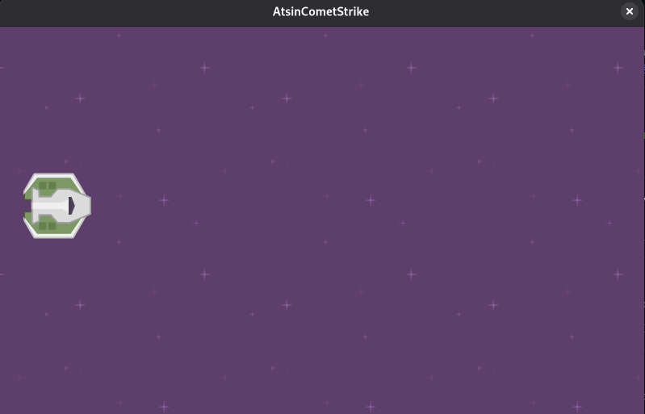

# AtsinCometStrike
<p align="center">
  
</p>

- It's a very simple 2D cooperative spaceship shooter game, made using MonoGame and Kenney.nl assets.

## How to Build and Run
### Prerequisites

* **.NET SDK:** You will need [.NET 10.0](https://dotnet.microsoft.com/download) or later.

### Steps to Run

1. **Clone the repository:**
```bash
git clone https://github.com/IzaltinoDomingosDeSouza/AtsinCometStrike.git
cd AtsinCometStrike

```


2. **Restore dependencies:**
```bash
dotnet restore

```


3. **Run the game:**
```bash
dotnet run

```

## 🎨 Credits

* **Engine:** [MonoGame](https://www.monogame.net/)
* **Assets:** [Kenney.nl](https://kenney.nl/)
